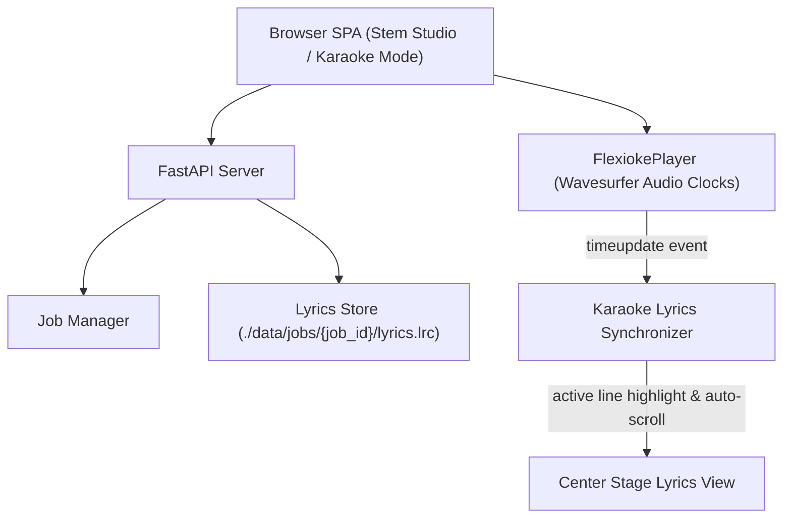

# Functional Specification: Version 2 — Synchronized Lyrics & Karaoke Player

## 1. System Architecture Overview
Version 2 extends the single-page application and backend with:
- Dedicated **Lyrics Storage Service** managing `.lrc` files in each job directory.
- **Lyrics Parser & Real-Time Synchronizer** in JavaScript mapping Wavesurfer audio timestamps to active lyric lines.
- **Two Tab Views:**
  - **Stem Studio View** (Multitrack Waveforms, Stems Mixing, Ingestion)
  - **Karaoke View** (Center Stage Synchronized Lyrics Display, Quick Karaoke Controls, Library & Queue)
- **Smart Play Interruption Controller** with confirmation dialogs.



## 2. API Specifications

### 2.1 Get Song Lyrics
- **Route:** `GET /api/jobs/{job_id}/lyrics`
- **Response `200 OK`:**
  ```json
  {
    "job_id": "79dd610c-7300-48e2-a058-f6e3214c1957",
    "lyrics": "[00:00.18] If I could be anybody...\n[00:05.17] Maybe I'd understand...",
    "has_lyrics": true,
    "has_timestamps": true
  }
  ```
- **Error `404 Not Found`:** If `job_id` is invalid. If the job exists but has no lyrics file, returns `200 OK` with `has_lyrics: false` and `lyrics: ""`.

### 2.2 Save Song Lyrics
- **Route:** `POST /api/jobs/{job_id}/lyrics`
- **Request Body:**
  ```json
  {
    "lyrics": "[00:00.18] If I could be anybody, I would be you\n[00:05.17] Maybe I'd understand the things that you do"
  }
  ```
- **Behavior:** Writes lyrics text into `./data/jobs/{job_id}/lyrics.lrc` using atomic file writing.
- **Response `200 OK`:** Returns the updated lyrics payload.

## 3. Frontend Functional Requirements

### 3.1 Top Navigation Tabs
- Persistent header contains a segmented tab switch:
  - `[ 🎛️ Stem Studio ]` | `[ 🎤 Karaoke Mode ]`
  - Clicking tabs toggles container visibility (`hidden` class) without remounting or pausing the audio elements.

### 3.2 Lyrics Editor Modal
- Each song item in the library has a `📝 Lyrics` action button.
- Clicking opens a modal containing:
  - Song title header.
  - Multi-line textarea pre-filled with existing lyrics if available.
  - Helpful hint: *"Supported format: `[mm:ss.xx] Lyric text` for synchronized playback, or plain text."*
  - **"Cancel"** and **"Save Lyrics"** buttons.
- On save, triggers `POST /api/jobs/{job_id}/lyrics` and refreshes current song lyrics state.

### 3.3 Synchronized Karaoke Stage Display
- **Timestamp Parsing:** Parses lines matching regex `/\[(\d{2}):(\d{2}(?:\.\d{1,3})?)\](.*)/`.
  - Calculates line start time: `mins * 60 + secs`.
- **Active Line Tracking:** Listens to `timeupdate` from audio player.
  - Identifies line $k$ where $\text{time}_k \le t < \text{time}_{k+1}$.
  - Applies `karaoke-line-active` class (magnified text, glowing indigo/emerald gradient, full opacity).
  - Past and future lines rendered in muted, semi-transparent slate.
- **Smooth Auto-Scroll:** Uses `element.scrollIntoView({ behavior: 'smooth', block: 'center' })` to keep the active line centered.
- **Fallbacks:**
  - If no lyrics: *"🎤 No lyrics added yet. Click '📝 Lyrics' on the song card to add lyrics."*
  - If plain text (no timestamps): Displays clean, readable scrollable transcript.

### 3.4 Smart Playback Interruption Guard
- If `flexiokePlayer.isPlaying == true` and a user clicks "Play" on a library song card:
  - Temporarily pauses playback.
  - Displays modal: *"A song is currently playing. Would you like to stop it and play '[New Title]' now? Your queued songs will remain in order."*
  - If "Proceed" is clicked: loads and plays the new song; existing queue is preserved.
  - If "Cancel" is clicked: resumes original playback.

### 3.5 Karaoke Quick Transport & Vocal Toggles
- **Play/Pause & Skip Next:** Shared transport controls.
- **Quick Vocal Mute Buttons:**
  - `[ 🎤 Lead Vocals: ON/OFF ]` — Mutes or unmutes the lead vocal stem so the user can sing lead.
  - `[ 👥 Backing Harmonies: ON/OFF ]` — Mutes or unmutes backing vocals.
  - Toggles visually indicate active/muted states with distinct pill colors (emerald/rose).

## 4. Acceptance Criteria
- [ ] Users can view, paste, and save `.lrc` lyrics for any song in the library.
- [ ] Karaoke Mode highlights and auto-scrolls lyrics matching playback timecode.
- [ ] Top-level tabs allow seamless switching between Stem Studio and Karaoke views without audio interruption.
- [ ] Quick Lead and Backing vocal toggles allow instant silencing of vocals during singing.
- [ ] Playback interruption prompt protects ongoing playback while preserving queue state.
